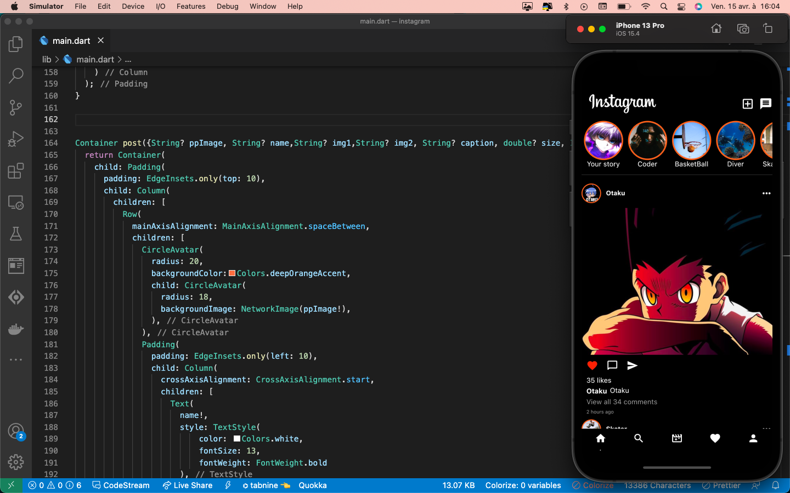

# instagram

Let's create a clone of the social media instagram  with Flutter.

<br>

## Development Setup
Clone the repository and run the following commands:
```
flutter pub get
flutter run
```

## Screenshots

